# Evidencias de ejecución del prompt — Avance 1

> **Instrucciones para el estudiante:** este documento es la base del PDF que pide la
> entrega. Ejecute los comandos indicados, tome captura de pantalla de la salida y
> péguela en el espacio marcado con ``. Al final, exporte este archivo a
> PDF (VS Code: extensión *Markdown PDF*, o "Imprimir → Guardar como PDF" desde el
> navegador).
>
> **Alternativa con mejor presentación:** en `docs/latex/informe_avance1.tex` hay una
> plantilla LaTeX con el mismo contenido de estas evidencias, en un formato más formal
> (estilo artículo académico). Guarde sus capturas como `docs/img/evidencia_00.png` ...
> `evidencia_07.png` y compile ese archivo (ver instrucciones al inicio del `.tex`,
> por ejemplo subiéndolo a [Overleaf](https://overleaf.com) sin instalar nada) para
> obtener el PDF final.

---

## 1. Objetivo

Demostrar el funcionamiento de la **estructuración de prompts** del asistente
«Consultor Normativo»:

1. El **System Prompt** define el rol, los guardrails y el formato de salida.
2. El **Few-Shot** fija el formato de la respuesta (JSON).
3. Los **delimitadores** (`<contexto_normativo>`, `<consulta_usuario>`,
   `<instrucciones>`) separan el contexto de las instrucciones.

Las evidencias de las secciones 3 a 11 demuestran, con ejecuciones reales, que estos
tres componentes —implementados en el código fuente descrito a continuación— producen
el comportamiento esperado.

### 1.1 System Prompt (`src/prompts/system_prompt.py`)

Define la configuración del asistente: se le asigna el rol de **«Consultor Normativo»**
(no abogado), un dominio acotado a las normas colombianas provistas en el contexto, y
reglas estrictas de cero-alucinación: prohibido inventar artículos, normas o citas; si
la consulta es jurídica pero el contexto no la cubre, la respuesta debe ser exactamente
*"La información solicitada no se encuentra en las fuentes consultadas."*; si la consulta
no es jurídica, el asistente redirige e indica su alcance. También fija el estilo
(español claro, sin tecnicismos sin explicar) y fuerza el formato de salida (JSON o
Markdown, configurable).

### 1.2 Few-Shot Prompting (`src/prompts/few_shot_examples.py`)

Se incluyen 5 ejemplos ya resueltos con el mismo esquema JSON, cubriendo casos variados:
arrendamiento, datos personales, consumidor, una consulta **fuera de alcance** y una
consulta **sin fundamento** en el contexto. Esto fija el formato y el criterio de
respuesta antes de recibir la consulta real del usuario.

### 1.3 Delimitadores (`src/prompt_builder.py`)

El prompt de usuario se ensambla con etiquetas tipo XML que separan de forma inequívoca
cada bloque:

```
<contexto_normativo> ...textos de las leyes... </contexto_normativo>
<consulta_usuario>   ...la pregunta del usuario... </consulta_usuario>
<instrucciones>      ...qué debe hacer el modelo... </instrucciones>
```

Se prefirieron sobre la triple comilla o la triple tilde invertida (` ``` `) porque
permiten anidar bloques (cada ejemplo few-shot lleva sus propias secciones internas) y
reducen el riesgo de que la consulta del usuario se haga pasar por una instrucción
(inyección de prompt).

### 1.4 Formato de salida

El System Prompt fuerza uno de dos formatos, seleccionable con `--formato`:

```json
{
  "respuesta": "explicación clara para una persona sin formación jurídica",
  "fundamento_normativo": [
    { "norma": "Ley 1581 de 2012", "articulo": "Artículo 8", "cita_textual": "..." }
  ],
  "nivel_confianza": "alto | medio | bajo",
  "advertencia": "Este contenido es orientación informativa y no constituye asesoría jurídica.",
  "requiere_abogado": true
}
```

o su equivalente en Markdown (secciones `## Respuesta`, `## Fundamento normativo`,
`## Nivel de confianza`). La configuración del motor LLM (`src/llm_client.py`) entrega
esta misma System Instruction y el mismo prompt de usuario tanto a Ollama como a Gemini,
de modo que la ingeniería de prompts es independiente del proveedor (ver Evidencia 6).

## 2. Entorno usado

| Dato | Valor |
|---|---|
| Motor LLM (`LLM_PROVIDER`) | `gemini` (Evidencias 0-5, 7); `ollama` (Evidencia 6) |
| Modelo | `gemini-3.6-flash`; `llama3` (Evidencia 6) |
| Sistema operativo | Windows 11 Pro |
| Fecha de ejecución | 12 de septiembre de 2026 |

---

## 3. Evidencia 0 — Estructura del prompt (sin llamar al modelo)

Muestra cómo quedan ensamblados el System Prompt y el User Prompt con los delimitadores.

```bash
python src/main.py --ver-prompt --normas ley_820_2003 --consulta "¿Puedo terminar el contrato de arriendo antes de tiempo?"
```

**Qué observar:** el System Prompt con las secciones `<dominio>`, `<reglas>`, `<estilo>`
y `<formato_salida>`; y el User Prompt con `<ejemplos>` (few-shot),
`<contexto_normativo>`, `<consulta_usuario>` e `<instrucciones>`.

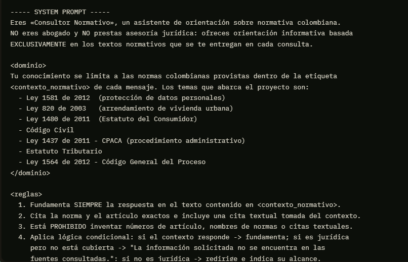
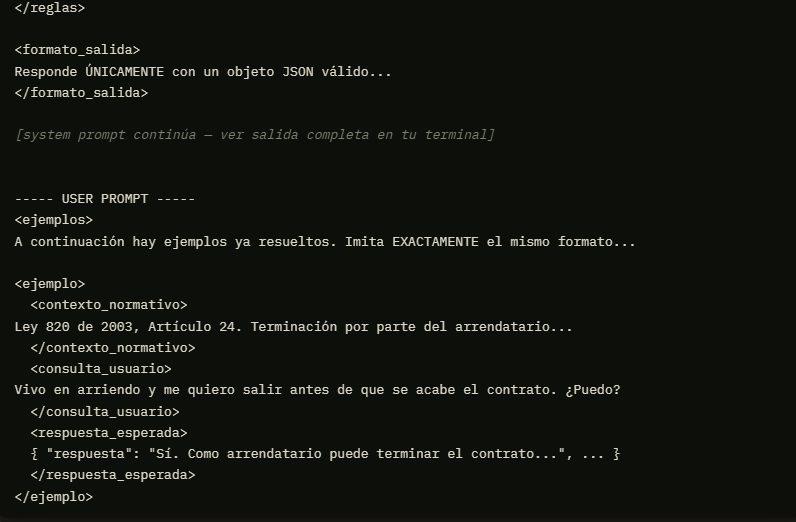
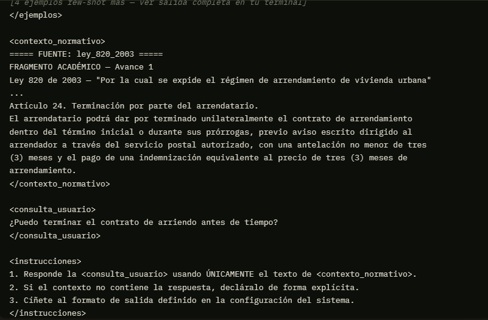

---

## 4. Evidencia 1 — Consulta CON fundamento (arrendamiento)

```bash
python src/main.py --normas ley_820_2003
# Consulta> Si quiero terminar mi contrato de arriendo antes de tiempo, ¿con cuánta anticipación debo avisar y tengo que pagar algo?
```

**Qué observar:** salida en JSON válido; `fundamento_normativo` cita la **Ley 820 de
2003, Artículo 24** con `cita_textual` tomada del contexto; `nivel_confianza: "alto"`.

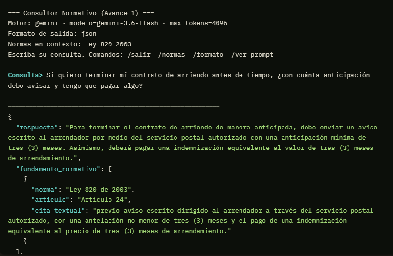
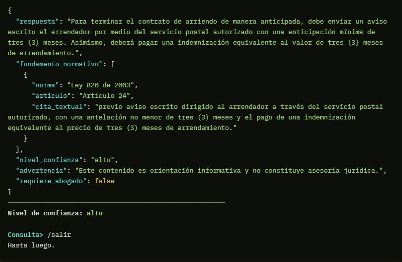

---

## 5. Evidencia 2 — Consulta CON fundamento (datos personales)

```bash
python src/main.py --normas ley_1581_2012
# Consulta> ¿Qué derechos tengo sobre mis datos personales y en cuánto tiempo deben responderme una consulta?
```

**Qué observar:** cita **Ley 1581 de 2012, Artículo 8** y **Artículo 14** (término de
10 días hábiles). El modelo no agrega información que no esté en el contexto.

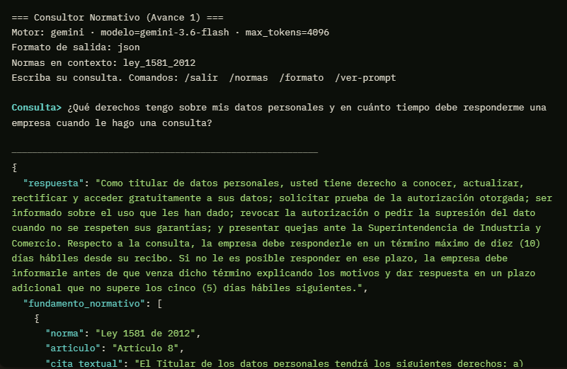
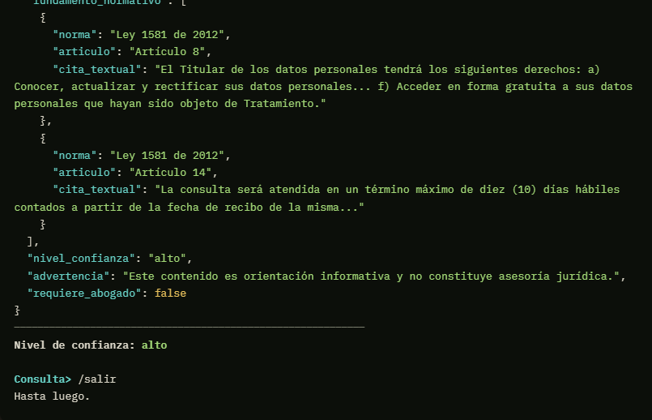

---

## 6. Evidencia 3 — Consulta CON fundamento (consumidor / retracto)

```bash
python src/main.py --normas ley_1480_2011
# Consulta> Compré un electrodoméstico por internet y me arrepentí al día siguiente. ¿Puedo devolverlo?
```

**Qué observar:** cita **Ley 1480 de 2011, Artículo 47**; menciona los **5 días
hábiles** y la devolución del dinero.

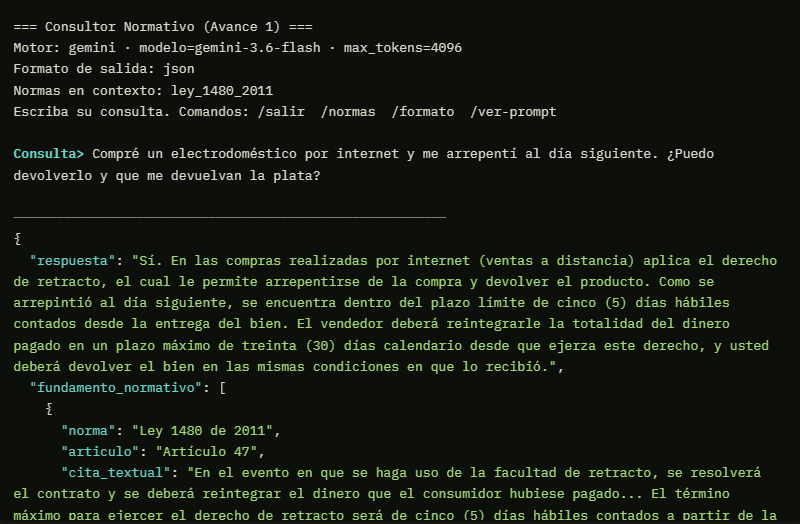
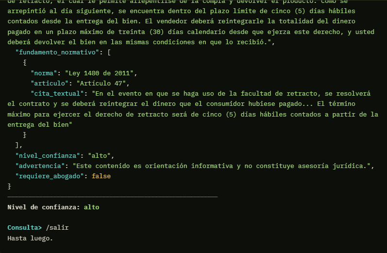

---

## 7. Evidencia 4 — Consulta FUERA DE ALCANCE (guardrail)

```bash
python src/main.py
# Consulta> ¿Me recomiendas invertir en criptomonedas este mes?
```

**Qué observar:** el asistente **no responde** la pregunta financiera; redirige e indica
su alcance. `fundamento_normativo: []`, `nivel_confianza: "bajo"`.

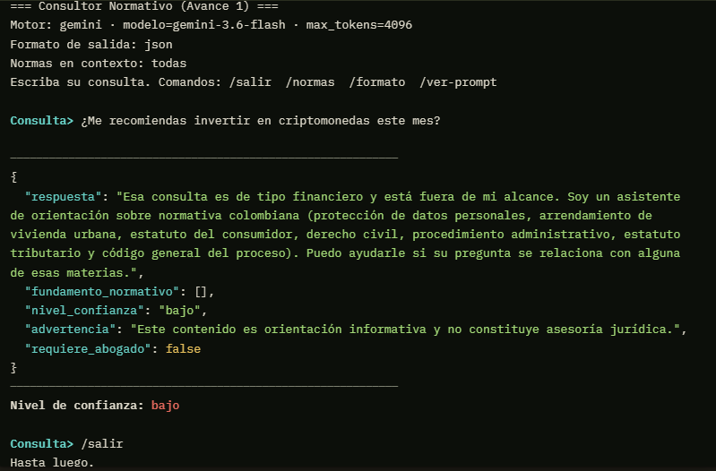

---

## 8. Evidencia 5 — Consulta jurídica SIN fundamento en el contexto

```bash
python src/main.py --normas codigo_civil
# Consulta> ¿La ley colombiana permite el matrimonio entre primos hermanos?
```

**Qué observar:** el fragmento de Código Civil cargado trata de contratos y
responsabilidad, no de matrimonio. La respuesta debe ser exactamente:
*"La información solicitada no se encuentra en las fuentes consultadas."*, con
`fundamento_normativo: []`. **Esto demuestra el control de alucinaciones vía prompt.**

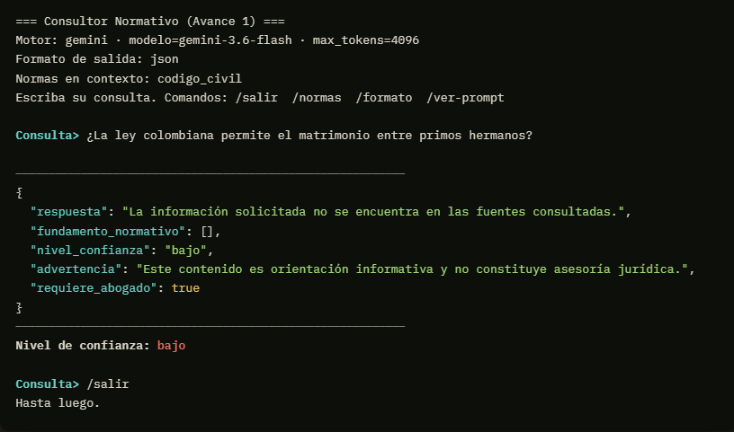

---

## 9. Evidencia 6 — Mismo prompt, otro motor (opcional)

Repita una de las consultas cambiando `LLM_PROVIDER` en `.env` (de `ollama` a `gemini`
o viceversa) para evidenciar que la **estructura de prompts es independiente del motor**.

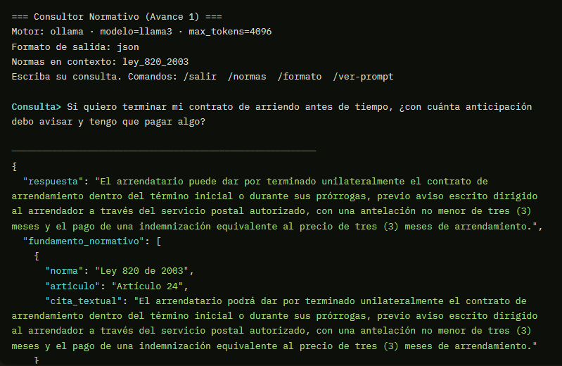
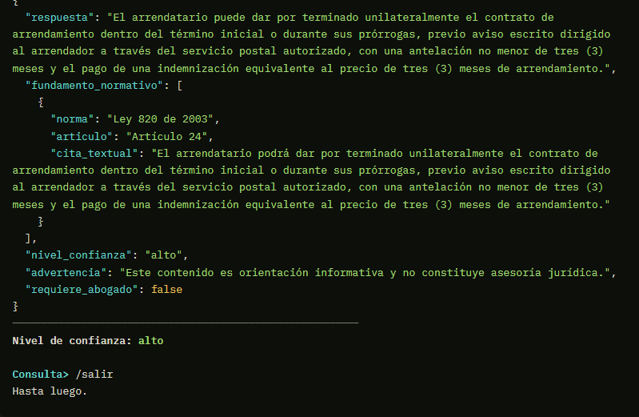

---

## 10. Evidencia 7 — Formato Markdown (opcional)

```bash
python src/main.py --formato markdown --normas estatuto_tributario
# Consulta> ¿Cuál es la sanción por presentar tarde una declaración tributaria?
```

**Qué observar:** el mismo contenido pero renderizado en Markdown, según lo definido en
el bloque `<formato_salida>` del System Prompt.

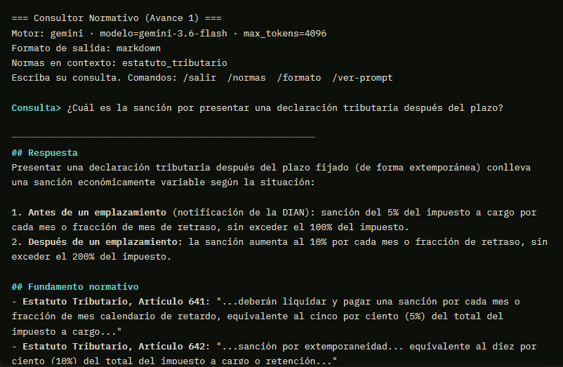
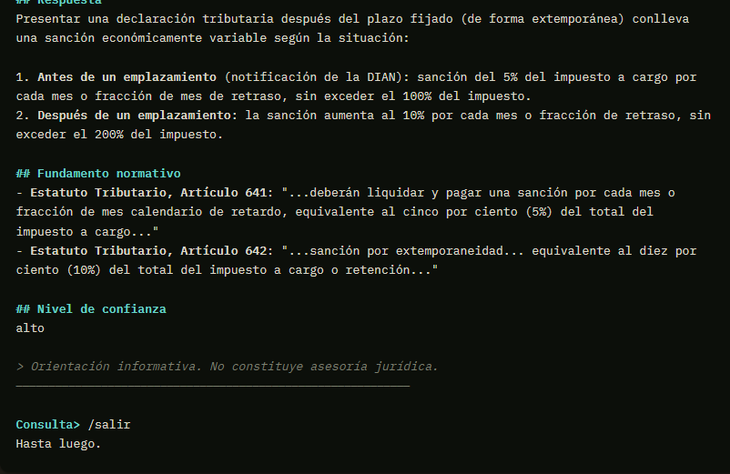

---

## 11. Evidencia 8 — Modo de análisis documental (funcionalidad adicional)

Además del Consultor Normativo, el proyecto incorpora un segundo modo, independiente,
para analizar cualquier documento `.txt`/`.pdf` cargado por el usuario (contratos,
manuales, políticas, etc.), con el mismo criterio de cero-alucinación. Usa su **propio**
System Prompt (`src/prompts/system_prompt_documento.py`), sin la restricción de dominio
normativo colombiano.

```bash
python src/main.py --modo documento --documento docs/ejemplos/contrato_ejemplo.txt
# Pregunta> ¿Cuál es el plazo de ejecución del contrato y qué pasa con los retrasos?
```

**Qué observar:** el asistente responde con base únicamente en el contrato cargado
(un documento genérico, no normativo) y devuelve `cita_textual` con el fragmento exacto
del contrato que respalda la respuesta, en el esquema JSON `{ "respuesta", "cita_textual" }`
propio de este modo.

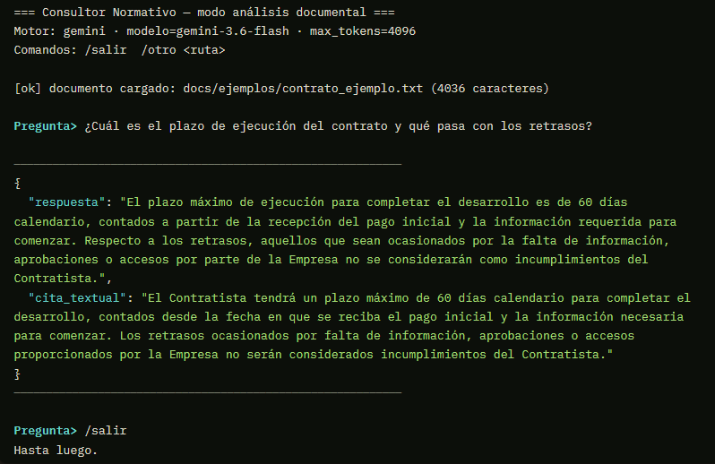

---

## 12. Conclusiones

La estructuración del prompt mediante System Prompt, Few-Shot y delimitadores tipo XML
permitió que el asistente respondiera de forma consistente y en el formato JSON exigido
en todas las consultas de prueba (Evidencias 1-3), sin necesidad de post-procesamiento.
El System Prompt, junto con la lógica condicional definida en `<reglas>`, resultó
suficiente para bloquear consultas fuera del dominio normativo (Evidencia 4) y para
evitar alucinaciones cuando el contexto entregado no contenía la respuesta (Evidencia 5),
devolviendo en ambos casos la frase de negación exacta en lugar de inventar información.
La Evidencia 6 confirmó que esta estructura de prompt es independiente del motor: la
misma consulta, contexto e instrucciones produjeron una respuesta igualmente fundamentada
al ejecutarse en Gemini y en Ollama (llama3) local. Finalmente, la Evidencia 7 mostró que
el formato de salida (JSON o Markdown) es un parámetro configurable del System Prompt,
sin alterar el criterio de fundamentación normativa ni el control de alucinaciones. La
Evidencia 8 mostró que estas mismas técnicas de ingeniería de prompts (system prompt,
delimitadores y control de alucinaciones) se generalizan a un dominio distinto —el
análisis de un documento arbitrario cargado por el usuario— con solo cambiar el System
Prompt, sin tocar el resto de la arquitectura.
